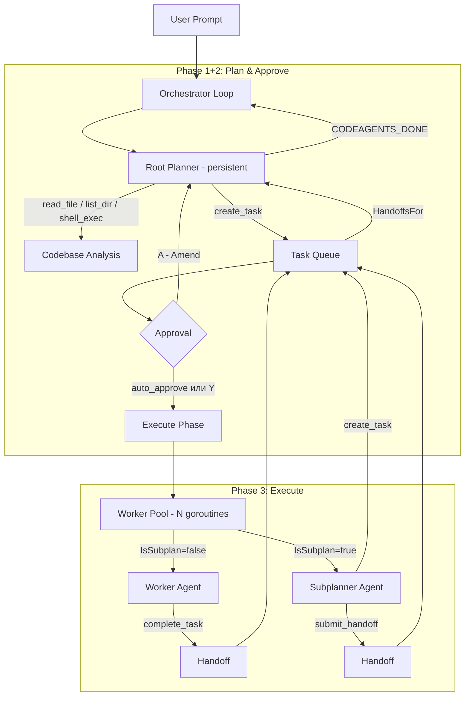
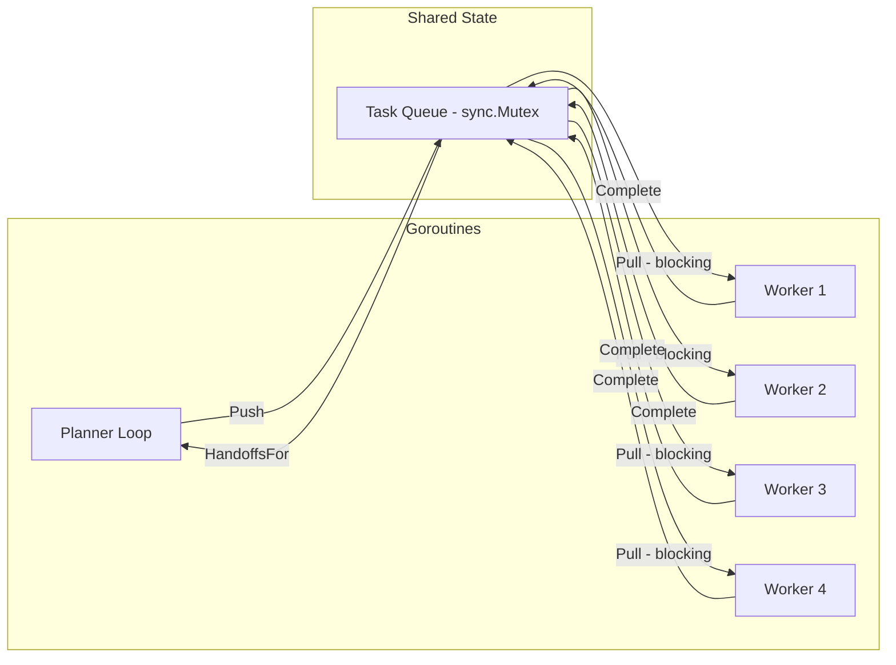

# Архитектура Code-Agents

## Обзор

Code-Agents -- многоагентная система для автономной работы над кодовыми базами. Архитектура вдохновлена исследованием Cursor "Self-Driving Codebases" и использует иерархическую модель с тремя ролями агентов.

В качестве LLM-провайдера используется любой OpenAI-compatible API endpoint с возможностью выбора модели для каждого типа агента.

Паттерн loop-оркестратора адаптирован из проекта [clancy](https://github.com/eduardolat/clancy).

## Иерархия агентов

```
                    ┌──────────────────┐
                    │   Root Planner    │
                    │ (стратегический)  │
                    └────────┬─────────┘
                             │ создает задачи
                    ┌────────▼─────────┐
              ┌─────┤   Task Queue     ├─────┐
              │     └──────────────────┘     │
              │                              │
     ┌────────▼─────────┐          ┌────────▼─────────┐
     │   Subplanner      │          │     Worker        │
     │ (тактический)     │          │ (исполнитель)     │
     └────────┬─────────┘          └────────┬─────────┘
              │ подзадачи                    │ handoff
              ▼                              ▼
         Task Queue                    Queue.Complete()
```

### Root Planner

- Получает пользовательский промпт целиком
- Декомпозирует работу на задачи через tool call `create_task`
- **Не пишет код** -- только планирует и координирует
- Мониторит Handoff-документы от workers/subplanners
- Непрерывно переоценивает состояние проекта
- Завершает работу сигналом `CODEAGENTS_DONE`

### Subplanner

- Владеет узким скоупом, определенным родительской задачей
- Рекурсивно декомпозирует свой скоуп на подзадачи
- Глубина рекурсии ограничена `max_depth`
- По завершении формирует агрегированный Handoff для родительского planner

### Worker

- Исполняет конкретную задачу с заданными constraints
- Имеет доступ к tools: файлы, shell, git
- Работает изолированно, не знает о других агентах
- По завершении возвращает Handoff-документ с:
  - Summary -- что было сделано
  - Findings -- что обнаружено
  - Concerns -- потенциальные проблемы
  - Feedback -- предложения для planner

## Поток данных



Информация течет **только вверх** через Handoff-документы. Агенты не имеют доступа к глобальному состоянию. Planner видит handoffs только от своих прямых дочерних задач.

Оркестрация работает по принципу **Plan → Approve → Execute**, а не параллельного запуска planner + workers. Planner сначала создаёт план (может анализировать код), пользователь одобряет, затем workers выполняют задачи пакетом.

## Принципы проектирования

### 1. Anti-fragility (антихрупкость)

Падение одного агента не роняет систему. Если worker fails:
- Задача помечается `StatusFailed` в очереди
- Planner видит failed задачу в следующем цикле
- Planner создает замещающую задачу или корректирует план

### 2. Throughput > Correctness (пропускная способность важнее идеальности)

Система принимает стабильный процент ошибок вместо сериализации на идеальных коммитах. Ошибки исправляются итеративно другими агентами или повторными задачами.

### 3. Constraints over Instructions (ограничения вместо инструкций)

System prompts определяют **границы** поведения агента, а не пошаговые инструкции. Задачи содержат `constraints` -- что нельзя делать и какие границы соблюдать. Это эффективнее чем детальные чеклисты.

### 4. Information Flows Upward (информация течет вверх)

Никакой глобальной синхронизации или shared state. Workers возвращают Handoff-документы. Planners читают handoffs от своих задач. Subplanners агрегируют handoffs и передают выше.

### 5. No Static Plans (нет статичных планов)

Root Planner непрерывно переоценивает ситуацию на основе:
- Количества pending/completed/failed задач
- Содержимого свежих handoffs
- Новых findings и concerns от workers

## Модель конкурентности



- **Planner** работает в отдельной goroutine, цикл с `step_delay` между итерациями
- **Workers** работают в пуле goroutines (размер = `max_workers`), блокируются на `Queue.Pull()`
- **Queue** защищена `sync.Mutex`, notification через `chan struct{}`
- **Context** с глобальным timeout пробрасывается всем goroutines
- При отмене context все goroutines завершаются корректно

## Взаимодействие с LLM

Агенты используют `llm.ProviderPool` — кэш thread-safe клиентов, позволяющий каждой роли работать со своим LLM-провайдером. Если `agents.*.provider` не задан, все роли используют глобальный `provider`. Каждый клиент отправляет запросы на `/chat/completions` OpenAI-compatible endpoint. Различия между типами агентов:

| Аспект | Planner | Subplanner | Worker |
|--------|---------|------------|--------|
| Model | настраиваемая (e.g. qwen-72b) | настраиваемая | настраиваемая (e.g. qwen-32b) |
| Temperature | низкая (0.2-0.3) | низкая | низкая |
| Max tokens | 4096 | 4096 | 8192 |
| Tools | create_task | create_task, submit_handoff | file, shell, git, complete_task |
| System prompt | planning & coordination | scoped planning | implementation |

Модель для каждой роли задается в конфигурации, что позволяет использовать тяжелые модели для planners и легкие для workers.
