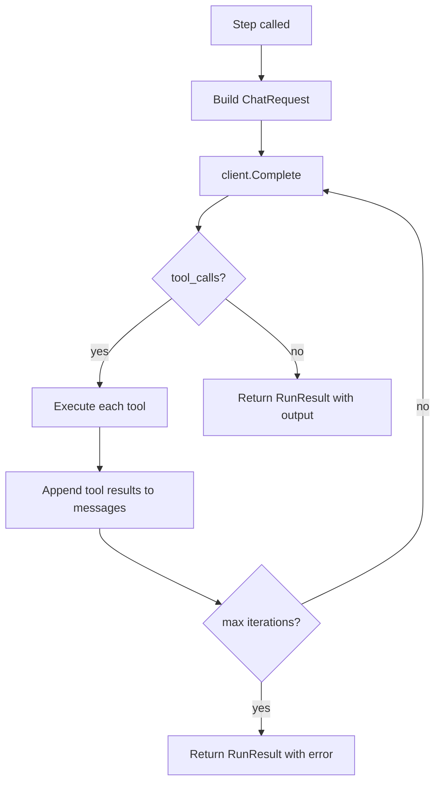

# Ключевые интерфейсы и типы

## Обзор

Система строится на нескольких ключевых абстракциях. Все типы находятся в `internal/` и не экспортируются за пределы модуля.

---

## 1. LLM Client (`internal/llm`)

### Типы сообщений

```go
package llm

// Role определяет роль в conversation.
type Role string

const (
    RoleSystem    Role = "system"
    RoleUser      Role = "user"
    RoleAssistant Role = "assistant"
    RoleTool      Role = "tool"
)

// ChatMessage -- одно сообщение в conversation.
type ChatMessage struct {
    Role       Role       `json:"role"`
    Content    string     `json:"content,omitempty"`
    ToolCalls  []ToolCall `json:"tool_calls,omitempty"`   // только для assistant
    ToolCallID string     `json:"tool_call_id,omitempty"` // только для tool
}

// ToolCall -- вызов инструмента, возвращенный LLM.
type ToolCall struct {
    ID       string       `json:"id"`
    Type     string       `json:"type"` // всегда "function"
    Function FunctionCall `json:"function"`
}

// FunctionCall -- имя функции и JSON-строка аргументов.
type FunctionCall struct {
    Name      string `json:"name"`
    Arguments string `json:"arguments"` // JSON string
}
```

### Tool Definitions (для запроса к LLM)

```go
// ToolDefinition описывает инструмент для LLM.
type ToolDefinition struct {
    Type     string         `json:"type"` // "function"
    Function FunctionSchema `json:"function"`
}

// FunctionSchema -- JSON Schema описание функции.
type FunctionSchema struct {
    Name        string      `json:"name"`
    Description string      `json:"description"`
    Parameters  interface{} `json:"parameters"` // JSON Schema object
}
```

### Request / Response

```go
// ChatRequest -- запрос к /chat/completions.
type ChatRequest struct {
    Model       string           `json:"model"`
    Messages    []ChatMessage    `json:"messages"`
    Tools       []ToolDefinition `json:"tools,omitempty"`
    Temperature float64          `json:"temperature,omitempty"`
    MaxTokens   int              `json:"max_tokens,omitempty"`
}

// ChatResponse -- ответ от /chat/completions.
type ChatResponse struct {
    ID      string   `json:"id"`
    Choices []Choice `json:"choices"`
    Usage   Usage    `json:"usage"`
}

// Choice -- один вариант ответа.
type Choice struct {
    Message      ChatMessage `json:"message"`
    FinishReason string      `json:"finish_reason"` // "stop", "tool_calls", "length"
}

// Usage -- статистика потребления токенов.
type Usage struct {
    PromptTokens     int `json:"prompt_tokens"`
    CompletionTokens int `json:"completion_tokens"`
    TotalTokens      int `json:"total_tokens"`
}
```

### Client

```go
// Client -- OpenAI-compatible HTTP клиент.
// Thread-safe: можно использовать из нескольких goroutines.
type Client struct {
    baseURL    string
    apiKey     string
    httpClient *http.Client
}

// NewClient создает клиент с указанным endpoint и ключом.
func NewClient(baseURL, apiKey string) *Client

// Complete отправляет chat completion запрос и возвращает ответ.
// Реализует retry с exponential backoff при 429/5xx ответах.
func (c *Client) Complete(ctx context.Context, req ChatRequest) (*ChatResponse, error)
```

### ProviderPool

```go
// ProviderPool кэширует LLM клиентов по паре (baseURL, apiKey).
// Используется оркестратором для поддержки per-agent provider overrides.
// Thread-safe.
type ProviderPool struct { ... }

// NewProviderPool создает пустой пул.
func NewProviderPool() *ProviderPool

// Get возвращает существующий Client или создает новый для заданных credentials.
func (p *ProviderPool) Get(baseURL, apiKey string) *Client
```

Клиент отправляет `POST {baseURL}/chat/completions` с заголовками:
- `Content-Type: application/json`
- `Authorization: Bearer {apiKey}`

---

## 2. Tool System (`internal/tool`)

### Интерфейс Tool

```go
package tool

// Tool -- инструмент, доступный агенту.
type Tool interface {
    // Name возвращает уникальное имя инструмента (e.g. "read_file").
    Name() string

    // Description возвращает описание для LLM.
    Description() string

    // Parameters возвращает JSON Schema параметров инструмента.
    Parameters() interface{}

    // Execute выполняет инструмент с JSON-строкой аргументов.
    // Возвращает текстовый результат или ошибку.
    Execute(ctx context.Context, args string) (string, error)
}
```

### Registry

```go
// Registry -- реестр доступных инструментов.
type Registry struct {
    tools map[string]Tool
}

// NewRegistry создает пустой реестр.
func NewRegistry() *Registry

// Register добавляет инструмент. Паника при дубликате имени.
func (r *Registry) Register(t Tool)

// Get возвращает инструмент по имени.
func (r *Registry) Get(name string) (Tool, bool)

// Definitions возвращает []llm.ToolDefinition для передачи в ChatRequest.
func (r *Registry) Definitions() []llm.ToolDefinition

// Names возвращает список имен зарегистрированных инструментов.
func (r *Registry) Names() []string
```

Каждый тип агента получает свой Registry с соответствующим набором tools:

| Роль | Доступные tools |
|------|----------------|
| Planner | `create_task` |
| Subplanner | `create_task`, `submit_handoff` |
| Worker | `read_file`, `write_file`, `list_dir`, `shell_exec`, `git_status`, `git_diff`, `git_commit`, `complete_task` |

---

## 3. Agent (`internal/agent`)

### Types

```go
package agent

// Role -- роль агента в иерархии.
type Role string

const (
    RolePlanner    Role = "planner"
    RoleSubplanner Role = "subplanner"
    RoleWorker     Role = "worker"
)

// RunResult -- результат одного Step агента.
type RunResult struct {
    // Stop -- агент решил завершить работу (нет tool calls в ответе).
    Stop bool

    // Output -- текстовое содержимое последнего ответа assistant.
    Output string

    // Error -- ошибка при выполнении (LLM, tool, timeout).
    Error error

    // ToolCallsCount -- количество выполненных tool calls в этом Step.
    ToolCallsCount int

    // Usage -- накопленное потребление токенов за этот Step.
    Usage llm.Usage

    // ContextUtilization -- заполненность истории (0.0–1.0+, ratio к maxHistoryMessages).
    ContextUtilization float64
}
```

### Agent

```go
// Agent инкапсулирует одного LLM-агента с conversation и tools.
type Agent struct {
    id                 string          // уникальный ID (nanoid)
    role               Role
    client             llm.Completer   // интерфейс: Client или mock в тестах
    modelCfg           config.ModelConfig
    systemPrompt       string
    tools              *tool.Registry
    messages           []llm.ChatMessage
    maxHistoryMessages int
}

// New создает агента. Первым сообщением добавляется system prompt.
// maxHistoryMessages по умолчанию 50.
func New(
    id string,
    role Role,
    client llm.Completer,
    modelCfg config.ModelConfig,
    systemPrompt string,
    tools *tool.Registry,
) *Agent

// NewWithConfig создает агента с явным maxHistoryMessages.
func NewWithConfig(
    id string,
    role Role,
    client llm.Completer,
    modelCfg config.ModelConfig,
    systemPrompt string,
    tools *tool.Registry,
    maxHistoryMessages int,
) *Agent

// Step выполняет один полный "ход" агента:
//   1. Отправляет messages + tool definitions в LLM
//   2. Получает ответ
//   3. Если ответ содержит tool_calls:
//      a. Выполняет каждый tool через Registry
//      b. Добавляет tool results в messages
//      c. Повторяет с шага 1
//   4. Если ответ без tool_calls (finish_reason="stop"):
//      Возвращает RunResult{Stop: true, Output: content}
//   5. Максимум 20 итераций inner loop для защиты от зацикливания
func (a *Agent) Step(ctx context.Context) RunResult

// AddUserMessage добавляет user message в conversation.
// Используется оркестратором для инъекции статуса, задач, и т.д.
func (a *Agent) AddUserMessage(content string)

// ID возвращает уникальный идентификатор агента.
func (a *Agent) ID() string

// Messages возвращает текущую conversation history (для логирования/отладки).
func (a *Agent) Messages() []llm.ChatMessage
```

### Внутренний tool-use loop (Step)



---

## 4. Task System (`internal/task`)

### Task

```go
package task

// TaskStatus -- статус задачи в очереди.
type TaskStatus string

const (
    StatusPending   TaskStatus = "pending"   // ожидает worker
    StatusAssigned  TaskStatus = "assigned"  // взята worker
    StatusCompleted TaskStatus = "completed" // завершена с handoff
    StatusFailed    TaskStatus = "failed"    // провалена
)

// TaskPriority -- приоритет задачи.
type TaskPriority int

const (
    PriorityLow    TaskPriority = 0
    PriorityNormal TaskPriority = 1
    PriorityHigh   TaskPriority = 2
)

// Task -- единица работы в системе.
type Task struct {
    ID          string       `json:"id"`                    // nanoid
    ParentID    string       `json:"parent_id,omitempty"`   // ID создавшего planner/subplanner
    Title       string       `json:"title"`                 // краткое название
    Description string       `json:"description"`           // полное описание задачи
    Status      TaskStatus   `json:"status"`
    Priority    TaskPriority `json:"priority"`
    Scope       string       `json:"scope"`                 // какие файлы/области затрагивает
    Constraints []string     `json:"constraints"`           // ограничения для worker
    CreatedAt   time.Time    `json:"created_at"`
    AssignedTo  string       `json:"assigned_to,omitempty"` // ID worker agent
    Handoff     *Handoff     `json:"handoff,omitempty"`     // заполняется по завершении
    IsSubplan   bool         `json:"is_subplan"`            // true = отдать subplanner, false = worker
    Depth       int          `json:"depth"`                 // глубина в иерархии (0 = root)
}
```

### Handoff

```go
// Handoff -- документ передачи результатов от worker/subplanner к planner.
// Ключевой механизм информационного потока вверх по иерархии.
type Handoff struct {
    TaskID       string   `json:"task_id"`        // ID выполненной задачи
    AgentID      string   `json:"agent_id"`       // ID агента, выполнившего задачу
    Summary      string   `json:"summary"`        // что было сделано
    Findings     []string `json:"findings"`       // что обнаружено в процессе
    Concerns     []string `json:"concerns"`       // потенциальные проблемы
    Feedback     []string `json:"feedback"`       // предложения для planner
    FilesChanged []string `json:"files_changed"`  // измененные файлы
}
```

### Queue

```go
// Queue -- потокобезопасная очередь задач.
// Planners пушат задачи, workers пулят.
// Notification через channel: Pull блокируется, пока нет задач.
type Queue struct {
    mu       sync.Mutex
    tasks    map[string]*Task    // все задачи по ID
    pending  []*Task             // упорядоченные pending задачи
    handoffs map[string]*Handoff // handoffs по task ID
    notify   chan struct{}       // сигнал о новых задачах
}

// NewQueue создает пустую очередь.
func NewQueue() *Queue

// Push добавляет задачу в очередь.
// Вызывается planners через tool create_task.
func (q *Queue) Push(t *Task)

// Pull извлекает задачу с наивысшим приоритетом.
// Блокируется, пока нет доступных задач.
// Возвращает nil при отмене контекста.
func (q *Queue) Pull(ctx context.Context) *Task

// Complete помечает задачу завершенной и сохраняет handoff.
func (q *Queue) Complete(taskID string, h *Handoff)

// Fail помечает задачу проваленной с указанием причины.
func (q *Queue) Fail(taskID string, reason string)

// PendingCount возвращает количество pending задач.
func (q *Queue) PendingCount() int

// CompletedCount возвращает количество завершенных задач.
func (q *Queue) CompletedCount() int

// FailedCount возвращает количество проваленных задач.
func (q *Queue) FailedCount() int

// HandoffsFor возвращает все handoffs для задач, созданных указанным parent.
func (q *Queue) HandoffsFor(parentID string) []*Handoff

// AllDone возвращает true, когда нет pending и assigned задач.
func (q *Queue) AllDone() bool

// TasksByParent возвращает все задачи, созданные указанным parent.
// Используется planner для просмотра состояния своих задач.
func (q *Queue) TasksByParent(parentID string) []*Task
```

---

## 5. Orchestrator (`internal/orchestrator`)

```go
package orchestrator

// Orchestrator координирует все компоненты системы.
type Orchestrator struct {
    cfg    *config.Config
    client *llm.Client
    queue  *task.Queue
}

// New создает оркестратор из конфигурации.
func New(cfg *config.Config) *Orchestrator

// Run -- главная точка входа. Запускает planner и worker pool.
//
// Шаги:
//   1. Создает LLM Client из config.Provider
//   2. Создает Task Queue
//   3. Создает tool registries для каждой роли
//   4. Запускает root planner goroutine
//   5. Запускает max_workers worker goroutines
//   6. Ожидает: все задачи выполнены + planner завершился,
//      или timeout, или max_steps
//   7. Cancel context, дождаться завершения goroutines
//   8. Вернуть результат
func (o *Orchestrator) Run(ctx context.Context, prompt string) error
```

### Внутренние методы

```go
// runPlanner запускает root planner loop.
// Planner получает prompt, создает задачи, мониторит handoffs.
// Цикл: AddUserMessage(status) → Step() → check CODEAGENTS_DONE → sleep step_delay
func (o *Orchestrator) runPlanner(ctx context.Context, prompt string) error

// runSubplanner запускает subplanner для задачи с IsSubplan=true.
// Создает подзадачи, мониторит их handoffs, возвращает агрегированный handoff.
func (o *Orchestrator) runSubplanner(ctx context.Context, t *task.Task) error

// runWorker запускает worker goroutine.
// Цикл: Pull() → execute task → Complete/Fail → обратно к Pull
func (o *Orchestrator) runWorker(ctx context.Context, workerID string) error

// buildStatusMessage формирует текстовый статус для инъекции в planner.
// Включает: pending/completed/failed counts, recent handoffs summary.
func (o *Orchestrator) buildStatusMessage(parentID string) string
```

---

## 6. Runner (`internal/runner`)

Паттерн из clancy для кросс-платформенного shell execution.

```go
package runner

// AgentRunner -- интерфейс выполнения shell-команд.
type AgentRunner interface {
    // Run выполняет команду с указанными env vars.
    // Возвращает stdout+stderr output.
    Run(command string, env map[string]string) (output string, err error)
}

// RealRunner -- реальная реализация через os/exec.
type RealRunner struct{}

// NewRealRunner создает RealRunner.
func NewRealRunner() *RealRunner
```

Platform-specific реализации:

- **Unix** (`runner_unix.go`, build tag `//go:build !windows`): использует `sh -c` с PTY через `github.com/creack/pty`. Output стримится в stdout и буфер одновременно.

- **Windows** (`runner_windows.go`, build tag `//go:build windows`): использует `cmd /C` с pipes. Stdout и stderr через `io.MultiWriter`.

---

## 7. Config (`internal/config`)

```go
package config

type Config struct {
    Version  int            `yaml:"version"`
    Provider ProviderConfig `yaml:"provider"`
    Agents   AgentsConfig   `yaml:"agents"`
    Loop     LoopConfig     `yaml:"loop"`
    Tools    ToolsConfig    `yaml:"tools"`
    Input    InputConfig    `yaml:"input"`
}

// Load читает YAML файл и возвращает валидированный Config.
// Резолвит env: и file: префиксы, парсит duration строки.
func Load(path string) (*Config, error)

// ResolvePrompt резолвит input.prompt (inline или file:path).
func (c *Config) ResolvePrompt() (string, error)
```

Подробное описание полей -- см. [configuration.md](configuration.md).
