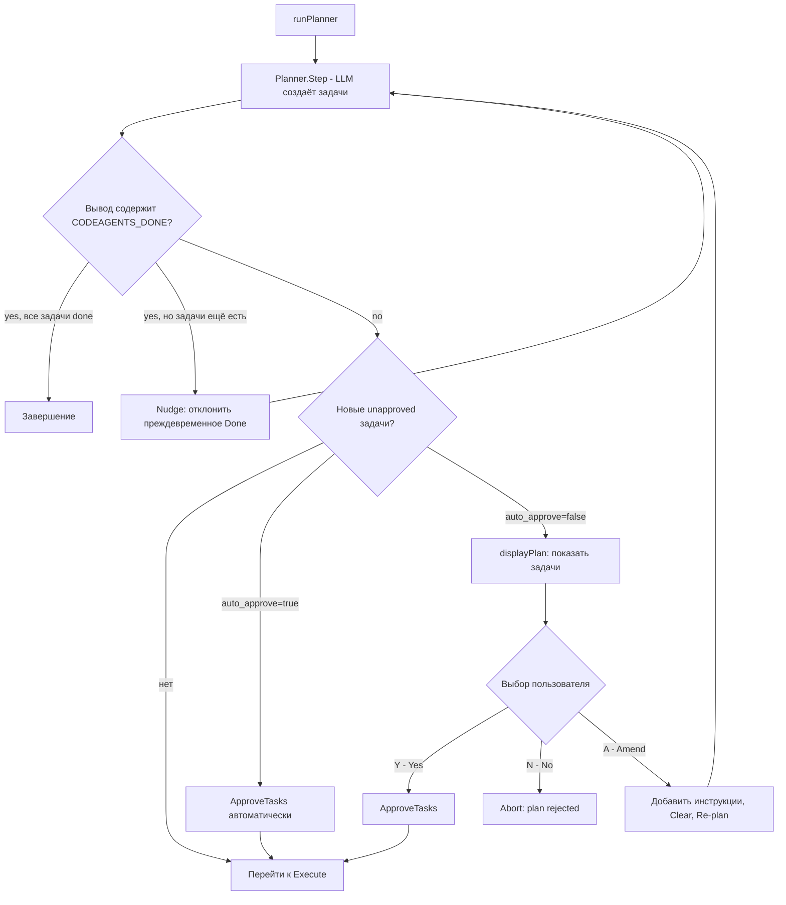
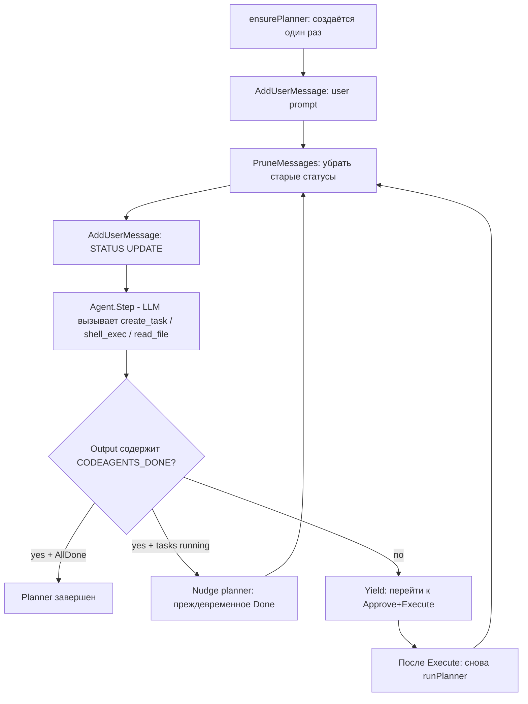
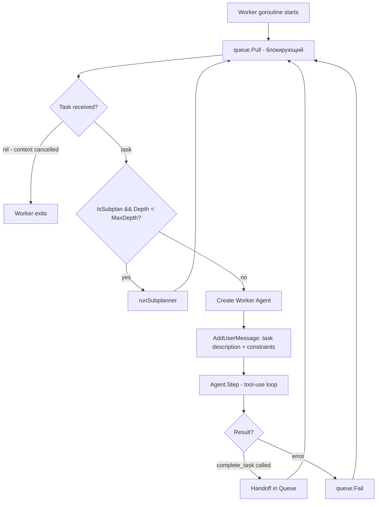
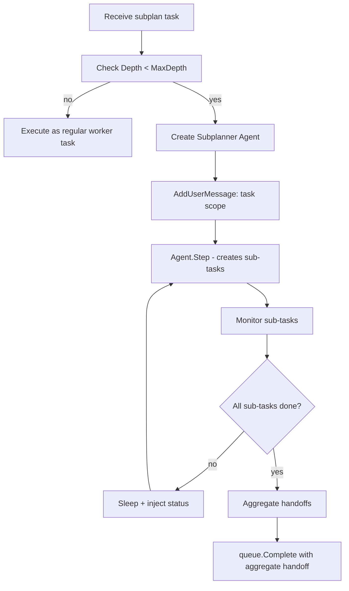

# Оркестрация: пошаговое описание

## Обзор

Оркестрация в Code-Agents построена на иерархическом loop-паттерне, адаптированном из clancy. Основное отличие -- clancy запускает один агент в loop, а Code-Agents координирует иерархию агентов через shared task queue.

Каждая итерация оркестратора проходит три фазы: **Plan → Approve → Execute**. После выполнения задач planner переоценивает ситуацию и цикл повторяется до сигнала `CODEAGENTS_DONE`.

---

## Phase 1: Initialization

Выполняется в `Orchestrator.Run()`.

```
1. Загрузить конфигурацию (уже сделано в cmd/main.go)
2. Резолвить prompt: inline или file:path → string
3. Создать llm.ProviderPool и llm.Client(baseURL, apiKey)
4. Создать task.Queue
5. Создать Planner Agent с tool registry:
   - plannerTools: {create_task, list_dir, read_file, shell_exec}
   (плюс worker/subplanner tools создаются при выполнении каждой задачи)
6. Создать context с timeout из config.Loop.Timeout
7. Запустить главный loop
```

### Инъекция Queue в Tools

Task tools (`create_task`, `complete_task`, `submit_handoff`) нуждаются в ссылке на Queue. `create_task` также принимает `parentID` и `depth` для отслеживания иерархии:

```go
// create_task tool создаётся с parentID и depth
plannerID, _ := gonanoid.New()
createTaskTool := tool.NewCreateTask(queue, plannerID, 0) // depth=0 для root planner
plannerTools.Register(createTaskTool)
plannerTools.Register(tool.NewListDir(cfg.Tools.WorkDir))
plannerTools.Register(tool.NewReadFile(cfg.Tools.WorkDir))
plannerTools.Register(tool.NewShellExec(runner, cfg.Tools.AllowedShell))
```

### Persistent Planner

Planner создаётся один раз (`ensurePlanner()`) и **сохраняется между итерациями** — история диалога накапливается. Старые status-сообщения обрезаются через `PruneMessagesByPrefix("=== STATUS UPDATE ===")` перед каждым шагом, чтобы не засорять контекст.

---

## Phase 2: Plan & Approve

После каждого шага планировщика выполняется проверка одобрения.



### Interactive Approval UI

При `auto_approve: false` (по умолчанию) оркестратор показывает план в консоли:

```
╔══════════════════════════════════════════════════════════╗
║                    EXECUTION PLAN                       ║
╠══════════════════════════════════════════════════════════╣
║  1. Implement JWT authentication module                  ║
║     Create JWT-based auth with login/logout endpoints    ║
║     Scope: auth/ directory                               ║
║  ──────────────────────────────────────────────────────  ║
║  2. Add unit tests for auth module                       ║
╠══════════════════════════════════════════════════════════╣
║  Total tasks: 2                                          ║
╚══════════════════════════════════════════════════════════╝

Choose an action:
  [Y]es    — approve and execute the plan
  [N]o     — reject and abort
  [A]mend  — add instructions and re-plan
```

При `[A]mend` пользователь вводит дополнительные инструкции, очередь очищается, planner получает `ADDITIONAL INSTRUCTIONS FROM USER:` и планирует заново.

---

## Phase 3: Root Planner Loop (внутренняя механика)

Выполняется внутри `runPlanner()`.



### Детализация каждого шага

**Шаг 1: Создание Planner Agent (один раз)**
```
agent.NewWithConfig(
    id:                 nanoid(),
    role:               RolePlanner,
    client:             llm.Client,
    modelCfg:           config.Agents.Planner.Model,
    systemPrompt:       config.Agents.Planner.SystemPrompt,
    tools:              plannerTools, // create_task + list_dir + read_file + shell_exec
    maxHistoryMessages: config.Agents.Planner.MaxHistoryMessages,
)
```

**Шаг 2: Инъекция промпта (только первый раз)**
```
planner.AddUserMessage(prompt)
```

**Шаг 3: Agent.Step()**

Planner вызывает LLM. LLM возвращает tool calls:
```json
{
  "tool_calls": [
    {
      "function": {
        "name": "create_task",
        "arguments": "{\"title\": \"Implement auth module\", ...}"
      }
    },
    {
      "function": {
        "name": "create_task",
        "arguments": "{\"title\": \"Add unit tests\", ...}"
      }
    }
  ]
}
```

Каждый `create_task` пушит Task в Queue. Agent.Step() автоматически выполняет tools и возвращает когда LLM отвечает текстом (без tool calls).

**Шаг 4: Проверка завершения**

Если `result.Output` содержит строку `CODEAGENTS_DONE` -- planner завершил работу.

**Шаг 5: Status injection**

```
planner.AddUserMessage(orchestrator.buildStatusMessage(planner.ID()))
```

Пример status message:
```
=== STATUS UPDATE ===
Tasks: 3 pending, 2 completed, 1 failed
Failed: "Add input validation" (reason: LLM timeout)

Recent handoffs:
---
Task: "Implement auth module"
Summary: Created JWT-based auth with middleware
Findings: [Existing session middleware can be reused]
Concerns: [No rate limiting on login endpoint]
Files changed: [auth/jwt.go, auth/middleware.go, auth/jwt_test.go]
---
Task: "Refactor database layer"
Summary: Migrated from raw SQL to sqlx
Findings: [3 queries had N+1 problems, fixed]
Concerns: [Migration script needed for production]
Files changed: [db/queries.go, db/models.go]
===
```

**Шаг 6: Reassess**

Planner видит handoffs, failed tasks, и решает:
- Создать замену для failed задачи
- Создать follow-up задачу на основе concerns
- Объявить `CODEAGENTS_DONE` если все готово

### Ограничения Planner Loop

- **max_steps** -- максимум итераций. По достижении -- ошибка.
- **timeout** -- из context. По истечении -- cancel.
- **step_delay** -- пауза между итерациями. Позволяет workers завершить задачи.

---

## Phase 4: Worker Pool

Запускается внутри `executeWorkers()`: `max_workers` горутин.



### Worker Agent Execution

Когда worker получает задачу, создается новый Agent (каждый раз свежий):

```
agent.NewWithConfig(
    id:                 nanoid(),
    role:               RoleWorker,
    client:             llm.Client,
    modelCfg:           config.Agents.Worker.Model,
    systemPrompt:       config.Agents.Worker.SystemPrompt,
    tools:              workerTools, // read_file, write_file, edit_file, replace_lines,
                                     // list_dir, shell_exec, git_*, complete_task
    maxHistoryMessages: config.Agents.Worker.MaxHistoryMessages,
)
```

Worker получает task как user message:
```
=== TASK ===
Title: Implement JWT authentication module
Description: Create a JWT-based authentication system with login/logout endpoints
Scope: auth/ directory
Constraints:
- Use github.com/golang-jwt/jwt/v5
- Follow existing middleware pattern in middleware/
- Include unit tests
- Do not modify existing endpoints
===
```

Worker Agent вызывает Step() -- внутренний tool-use loop:
1. LLM решает прочитать файлы → `read_file` tool calls
2. LLM генерирует код → `write_file` tool calls
3. LLM запускает тесты → `shell_exec("go test ./auth/...")`
4. LLM завершает → `complete_task` с Handoff документом

Worker Agent может вызвать Step() несколько раз (outer loop в runWorker), если одного Step недостаточно. Но в большинстве случаев один Step с внутренним tool-use loop покрывает всю задачу.

### Обработка ошибок Worker

Если worker сталкивается с ошибкой:
- LLM API error → retry внутри client.Complete (backoff)
- Tool execution error → tool возвращает ошибку как текст, LLM решает что делать
- Context cancelled → worker выходит, задача остается assigned
- Panic → recover в goroutine, queue.Fail(taskID)

---

## Phase 5: Subplanner Recursion

Когда worker goroutine получает задачу с `IsSubplan=true`:



### Subplanner создает подзадачи

```json
{
  "tool_calls": [
    {
      "function": {
        "name": "create_task",
        "arguments": {
          "title": "Create JWT token generation",
          "scope": "auth/jwt.go",
          "depth": 2,
          "is_subplan": false
        }
      }
    }
  ]
}
```

Подзадачи создаются с `depth = parent.depth + 1`. Workers из общего pool подхватывают их.

### Агрегация Handoffs

Когда все подзадачи subplanner'а завершены, он формирует агрегированный handoff:

```
Handoff{
    TaskID:   subplanTask.ID,
    AgentID:  subplanner.ID(),
    Summary:  "Auth module implemented: JWT generation, middleware, tests",
    Findings: [merged from all sub-handoffs],
    Concerns: [merged from all sub-handoffs],
    Feedback: [merged from all sub-handoffs],
    FilesChanged: [merged from all sub-handoffs],
}
```

Этот handoff возвращается parent planner через `queue.Complete()`.

### Ограничение глубины

```
MaxDepth = 3 означает:

Depth 0: Root Planner
Depth 1: Subplanner (или Worker)
Depth 2: Subplanner (или Worker)
Depth 3: Только Worker (дальнейшая рекурсия запрещена)
```

Если задача приходит с `IsSubplan=true` но `Depth >= MaxDepth`, она выполняется как обычная worker задача.

---

## Phase 6: Termination

Orchestrator ожидает завершения в main goroutine:

```go
// Упрощенная логика
for {
    select {
    case <-ctx.Done():
        // Глобальный timeout
        return ctx.Err()

    case <-plannerDone:
        // Planner завершился (CODEAGENTS_DONE)
        if queue.AllDone() {
            cancel() // останавливаем workers
            wg.Wait()
            return nil
        }
        // Ждем пока workers доделают оставшиеся задачи

    case <-time.After(1 * time.Second):
        // Polling: planner done + queue empty?
        if plannerExited && queue.AllDone() {
            cancel()
            wg.Wait()
            return nil
        }
    }
}
```

### Условия завершения

| Условие | Результат |
|---------|----------|
| Planner вывел `CODEAGENTS_DONE` + Queue.AllDone() | Успех (nil) |
| Context timeout | Ошибка: "global timeout reached" |
| Planner достиг max_steps | Ошибка: "max steps reached" |
| Planner error (LLM failure) | Ошибка из planner |

### Graceful Shutdown

1. `cancel()` -- отменяет context
2. Workers видят `ctx.Done()` в `queue.Pull()` -- возвращают nil
3. Worker goroutines завершаются
4. `wg.Wait()` -- ожидание завершения всех goroutines
5. Orchestrator.Run() возвращает результат

---

## Полная временная диаграмма

```
Time →
─────────────────────────────────────────────────────────────

Orchestrator:  [init] ──────────────────────── [wait] ─── [done]

Planner:       ──[prompt]──[create tasks]──[sleep]──[status+reassess]──[DONE]──
                     │          │                        │
                     │     ┌────┴────┐                   │
                     │     ▼         ▼                   │
Queue:         ─────[T1]──[T2]──[T3]──────[T4]──────────┘
                     │     │     │          │
                     ▼     ▼     ▼          ▼
Worker 1:      ─────[T1 execute]──[T4 execute]──
Worker 2:      ──────────[T2 execute]───────────
Worker 3:      ──────────────[T3→subplanner]────
                              │
                         ┌────┴────┐
                         ▼         ▼
Queue:              ───[T3a]────[T3b]───
                        │         │
Worker 1:          ────[T3a]─────────────
Worker 2:          ──────────[T3b]───────
```

---

## Сравнение с clancy

| Аспект | clancy | Code-Agents |
|--------|--------|-------------|
| Агенты | 1 внешняя CLI команда | N внутренних LLM-агентов |
| Loop | Простой retry loop | Иерархический: planner + workers |
| Состояние | Stateless (агент сам хранит) | Queue + Handoffs |
| Завершение | Stop phrase в output | `CODEAGENTS_DONE` + AllDone() |
| Конкурентность | Последовательный | Параллельный (goroutines) |
| Tool calling | Нет (CLI wrapper) | Встроенный через OpenAI API |
| Общее | Timeout, max_steps, delay | Timeout, max_steps, step_delay |
