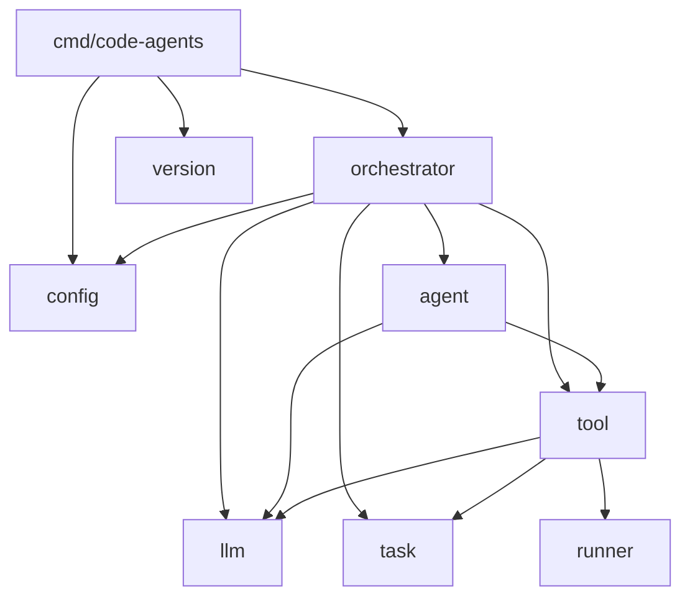

# Структура проекта Code-Agents

## Дерево каталогов

```
code-agents/
├── go.mod                              # module github.com/yourorg/code-agents
├── go.sum
├── code-agents.yaml                    # пример конфигурации
├── docs/                               # документация (этот каталог)
│   ├── architecture.md
│   ├── project-structure.md
│   ├── configuration.md
│   ├── interfaces.md
│   ├── orchestration-loop.md
│   └── tools.md
├── cmd/
│   └── code-agents/
│       ├── main.go                     # CLI точка входа
│       └── template.yaml               # embedded шаблон конфига (для --init)
├── internal/
│   ├── config/
│   │   ├── config.go                   # загрузка YAML, валидация, дефолты
│   │   └── config_test.go
│   ├── llm/
│   │   ├── types.go                    # ChatMessage, ToolCall, Request/Response
│   │   ├── client.go                   # OpenAI-compatible HTTP клиент
│   │   └── client_test.go
│   ├── agent/
│   │   ├── types.go                    # Role, RunResult
│   │   ├── agent.go                    # Agent: LLM + prompt + tools + agentic loop
│   │   └── agent_test.go
│   ├── tool/
│   │   ├── tool.go                     # Tool interface, Registry
│   │   ├── file.go                     # read_file, write_file, list_dir
│   │   ├── shell.go                    # shell_exec
│   │   ├── git.go                      # git_status, git_diff, git_commit
│   │   ├── task.go                     # create_task, complete_task, submit_handoff
│   │   └── tool_test.go
│   ├── task/
│   │   ├── types.go                    # Task, Handoff, TaskStatus, TaskPriority
│   │   ├── queue.go                    # Thread-safe task queue
│   │   └── queue_test.go
│   ├── orchestrator/
│   │   ├── orchestrator.go             # Orchestrator.Run() -- главная точка входа
│   │   ├── planner.go                  # Root Planner loop
│   │   ├── subplanner.go              # Subplanner recursive loop
│   │   ├── worker.go                   # Worker execution loop
│   │   └── orchestrator_test.go
│   ├── runner/
│   │   ├── runner.go                   # AgentRunner interface
│   │   ├── runner_unix.go              # Unix: PTY-based (build tag: !windows)
│   │   └── runner_windows.go           # Windows: pipe-based (build tag: windows)
│   └── version/
│       └── version.go                  # версия, коммит, дата сборки (ldflags)
└── prompts/                            # примеры промптов для задач
    ├── refactor.md
    ├── add-tests.md
    └── fix-bugs.md
```

## Назначение пакетов

### `cmd/code-agents`

CLI точка входа. Парсит аргументы командной строки (go-arg), загружает конфигурацию, создает и запускает Orchestrator. Минимум логики -- только wiring.

Поддерживаемые команды:
- `code-agents --config code-agents.yaml` -- запуск с конфигом
- `code-agents --init` -- создание шаблона конфига
- `code-agents --version` -- вывод версии

### `internal/config`

Загрузка и валидация YAML-конфигурации. Резолвинг значений:
- `env:VAR_NAME` -- чтение из переменной окружения
- `file:./path` -- чтение из файла
- Дефолтные значения для неуказанных полей
- Парсинг duration строк (`"30m"`, `"5s"`) в `time.Duration`

### `internal/llm`

HTTP клиент к OpenAI-compatible `/chat/completions` endpoint. Содержит:
- Типы сообщений (ChatMessage, ToolCall, FunctionCall)
- Типы запросов/ответов (ChatRequest, ChatResponse)
- Типы tool definitions (ToolDefinition, FunctionSchema)
- Thread-safe клиент с retry и exponential backoff

Никаких внешних SDK -- чистый `net/http` + `encoding/json`.

### `internal/agent`

Абстракция одного агента. Инкапсулирует:
- LLM client + model config
- System prompt
- Tool registry
- Conversation history ([]ChatMessage)
- Inner tool-use loop (Step method)

Агент не знает о своей роли в иерархии -- это определяется system prompt и набором доступных tools.

### `internal/tool`

Интерфейс `Tool` и реестр `Registry`. Конкретные реализации:
- **File tools** -- операции с файлами в рабочей директории
- **Shell tools** -- выполнение shell-команд (через runner)
- **Git tools** -- git операции
- **Task tools** -- создание задач и handoffs (мост между agent и queue)

### `internal/task`

Типы данных задач (`Task`, `Handoff`) и thread-safe очередь `Queue`. Очередь использует `sync.Mutex` для защиты и `chan struct{}` для notification (чтобы workers не busy-wait'или).

### `internal/orchestrator`

Координация всех компонентов:
- `orchestrator.go` -- создание client, queue, registries; запуск goroutines
- `planner.go` -- loop root planner с инъекцией статуса
- `subplanner.go` -- recursive loop для подзадач
- `worker.go` -- loop worker с pull/execute/complete

### `internal/runner`

Кросс-платформенный shell execution (паттерн из clancy):
- `runner.go` -- интерфейс `AgentRunner`
- `runner_unix.go` -- PTY через `github.com/creack/pty`
- `runner_windows.go` -- pipes через `os/exec`

Используется tool `shell_exec` для выполнения команд.

### `internal/version`

Build-time переменные (version, commit, date), заполняемые через `ldflags` при компиляции.

### `prompts/`

Примеры промптов для типовых задач. Не являются частью Go-кода -- это markdown-файлы, на которые можно ссылаться в конфиге через `input.prompt: "file:./prompts/refactor.md"`.

## Зависимости между пакетами



Зависимости однонаправленные. Нет циклических импортов.

## Внешние зависимости

| Пакет | Версия | Назначение |
|-------|--------|------------|
| `github.com/alexflint/go-arg` | v1.6+ | Парсинг CLI аргументов с автогенерацией help |
| `gopkg.in/yaml.v3` | v3.0+ | Парсинг YAML конфигурации |
| `github.com/matoous/go-nanoid/v2` | v2.1+ | Генерация коротких уникальных ID для агентов и задач |
| `github.com/creack/pty` | v1.1+ | PTY для Unix shell execution (build tag: !windows) |
| `github.com/stretchr/testify` | v1.11+ | Assertions и mocking в тестах |

Итого 5 прямых зависимостей. Минималистичный подход, аналогичный clancy.

## Сборка

```bash
# Обычная сборка
go build -o code-agents ./cmd/code-agents

# Сборка с версией
go build -ldflags "-X internal/version.Version=0.1.0 -X internal/version.Commit=$(git rev-parse HEAD)" \
    -o code-agents ./cmd/code-agents

# Кросс-компиляция
GOOS=linux GOARCH=amd64 go build -o code-agents-linux ./cmd/code-agents
GOOS=windows GOARCH=amd64 go build -o code-agents.exe ./cmd/code-agents
```
